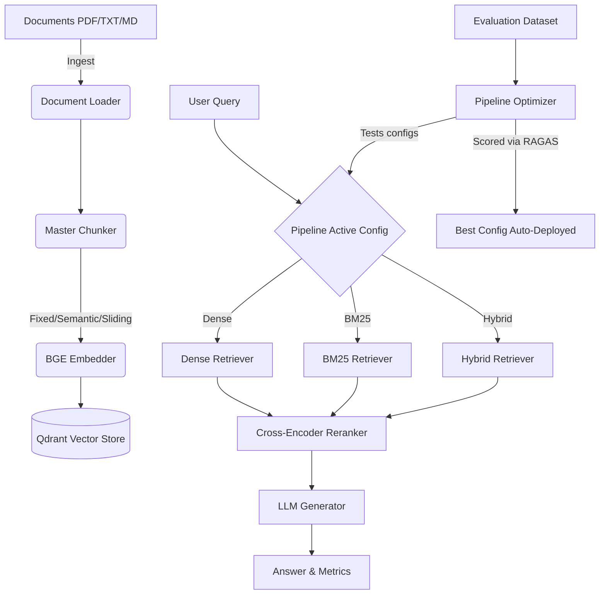

<<<<<<< HEAD
# Auto-RAG-Devops

An autonomous Retrieval-Augmented Generation (RAG) system that automatically evaluates and improves its own retrieval pipeline.

Designed for production environments, this system features modular architecture, scalable components, continuous integration testing, and a Streamlit dashboard.

---

## 🏗 Architecture Flow



## 🚀 Key Features

*   **Multi-Retriever System**: Switch seamlessly between Dense, Sparse (BM25), and Hybrid retrieval.
*   **Dynamic Chunking**: Configurable chunking rules including Naive Fixed, Semantic breakpoints, and token-based Sliding Windows.
*   **Pipeline Optimizer**: Grid-searches components, evaluated locally with RAGAS metrics (Faithfulness, Recall, Precision, Relevance) to find the optimal deployment config.
*   **Streamlit UI**: Full diagnostic view of the pipeline flow, ingestion controls, and evaluation tools.
*   **DevOps Ready**: Pre-configured CI/CD `rag_test.yml` for automated regressions testing on pull requests and deployments.

## 💻 Tech Stack

- **Core**: Python 3.11, FastAPI
- **RAG & Gen**: LangChain, OpenAI (`gpt-3.5-turbo`), BAAI `bge-small-en-v1.5`
- **Retrieval/Store**: Qdrant, `rank_bm25`, `ms-marco-MiniLM` cross-encoder reranker
- **Eval**: RAGAS
- **Ops**: Docker, GitHub Actions, Streamlit

---

## 🛠 Setup Instructions

### Prerequisites
1. Python 3.11+
2. Qdrant running locally (Docker recommended)
3. OpenAI API Key

### Local Installation

1. Clone repo:
    ```bash
    git clone https://github.com/my-org/auto-rag-devops.git
    cd auto-rag-devops
    ```

2. Install dependencies:
    ```bash
    pip install -r requirements.txt
    ```

3. Setup environment variables:
    Create a `.env` file in the root directory:
    ```env
    OPENAI_API_KEY=sk-...
    QDRANT_HOST=localhost
    QDRANT_PORT=6333
    ```

4. Run local Qdrant container:
    ```bash
    docker run -p 6333:6333 -p 6334:6334 qdrant/qdrant
    ```

### ▶️ Running Locally (Development)

**1. Start the FastAPI Backend:**
```bash
uvicorn backend.main:app --reload
```
API runs on `http://localhost:8000`. Swagger UI at `http://localhost:8000/docs`.

**2. Start the Streamlit Dashboard:**
```bash
streamlit run dashboard/streamlit_app.py
```
Dashboard runs on `http://localhost:8501`.

---

## 🐳 Docker and CI/CD

### Docker
To build and run the entire application using Docker:
```bash
docker build -t auto-rag-devops .
docker run -p 8000:8000 auto-rag-devops
```

### CI/CD
This project includes GitHub Actions workflows.
*   **.github/workflows/rag_test.yml**: Runs unit tests and simulated RAGAS evaluations on every Push/PR to `main`.
*   **.github/workflows/deploy.yml**: Builds Docker artifact and deploys on git tags.

---

## ❓ Example Queries

1. Ingest documents via the dashboard or using curl:
```bash
curl -X 'POST' \
  'http://localhost:8000/ingest?strategy=fixed' \
  -H 'accept: application/json' \
  -H 'Content-Type: multipart/form-data' \
  -F 'file=@sample.pdf'
```

2. Query the system:
```bash
curl -X 'POST' \
  'http://localhost:8000/query' \
  -H 'accept: application/json' \
  -H 'Content-Type: application/json' \
  -d '{
  "query": "What are the key features of this architecture?",
  "top_k": 5
}'
```
=======
# AutoRAG-DevOps-CI-CD-Driven-Self-Optimizing-Retrieval-Augmented-Generation-Architecture
>>>>>>> 15c579369339e093ae4cdc0a98bf23e8fca9322f
